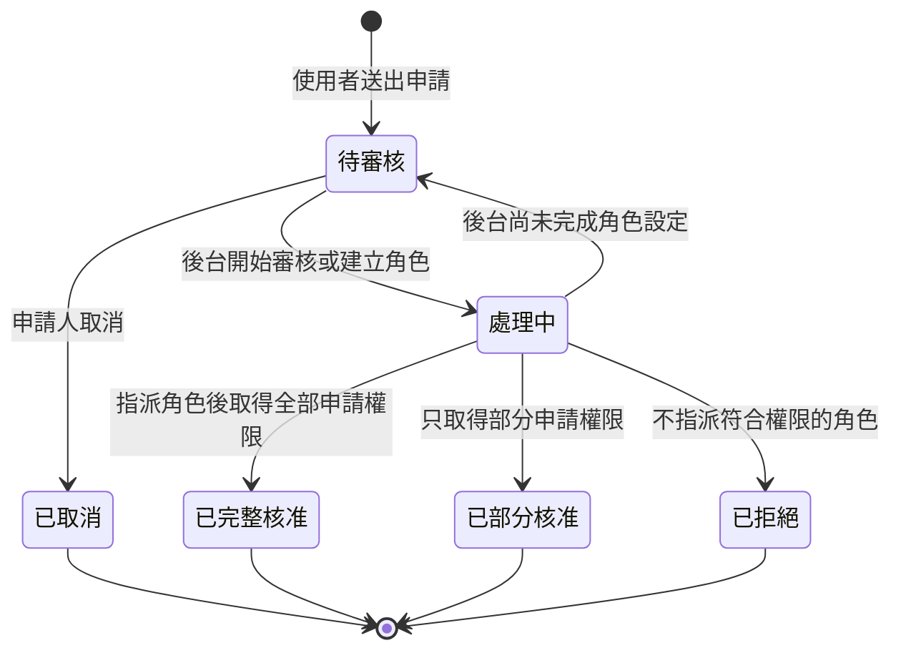

# 通知中心與待處理中心規格

- **狀態：** 已確認，可作為功能設計與開發依據
- **版本：** V1
- **範圍：** 前台與後台分離架構下的權限申請、跨端通知與待處理流程
- **依據：** [CONTEXT.md](../../CONTEXT.md)、[前後台分流與權限模型](front-back-office-migration.md)、`Project-Decisions.md` 的 PD-026～PD-029

## 1. 目標

建立一個前後台共用的通知中心與待處理中心，避免報表分類、角色與權限異動在前台和後台之間失去交接。

V1 的主要成果如下：

- 前台使用者可申請自己尚未擁有的報表分類權限或管理功能權限。
- 後台可在共用待處理清單審核申請，並以既有或新建角色完成授權。
- 報表分類新增時，後台會收到檢查角色權限的待處理事項。
- 使用者會收到自己角色、權限或申請結果的通知，並理解實際可使用的功能。

## 2. 現況與邊界

### 現況

- 前台使用者與後台帳號是獨立身分；單一 Session 只會是其中一種身分。
- 前台使用者可同時擁有多個角色；權限採 OR（Allow-Wins）合併。
- 報表分類權限包含「預覽、匯出、列印」；匯出與列印依賴預覽。
- 管理功能權限包含「資料庫管理」與「報表管理」，不屬於特定報表分類。
- 目前三位人員共用一組後台帳密，因此系統無法辨識實際處理待辦的個人。
- 現有前端服務中的 `NotificationService` 僅為短暫成功提示，不能作為本功能的資料模型或稽核紀錄。

### V1 不包含

- 個人後台帳號、個人認領、可靠的個人處理者稽核。
- 逾期時間、服務時限、自動催辦或升級通知。
- 未列於本規格的操作通知，例如一般登入或報表預覽。
- 使用者特例權限；所有授權仍須透過角色。
- 正式 API、資料庫遷移、即時推播技術的實作細節。本規格定義未來串接契約與行為。

## 3. 名詞與角色

| 名詞         | 定義                                                             |
| ------------ | ---------------------------------------------------------------- |
| 通知         | 供收件者知悉的歷史訊息。已讀代表看過，不代表完成任何工作。       |
| 待處理事項   | 需要採取動作並明確結案的項目。閱讀不改變其待處理狀態。           |
| 權限申請     | 前台使用者為一個報表分類或一個全域管理功能提出的授權請求。       |
| 角色導向核准 | 後台以指派角色完成核准，不直接寫入使用者特例權限。               |
| 有效權限     | 使用者所有有效角色以 OR 合併後，實際能使用的報表分類與管理功能。 |
| 後台共用帳號 | 目前由三人共同持有的後台身分。所有後台待辦由此帳號共用處理。     |

| 角色         | 可做的事                                                               |
| ------------ | ---------------------------------------------------------------------- |
| 前台使用者   | 查看自己的通知與待辦、提出或取消權限申請、查看申請結果。               |
| 後台共用帳號 | 查看所有後台待辦、審核申請、完成角色管理與角色指派、結案分類權限檢查。 |

## 4. V1 事件與收件者

| 來源事件                       | 收件者           | 中心項目                     | 結果                                     |
| ------------------------------ | ---------------- | ---------------------------- | ---------------------------------------- |
| 前台新增報表分類               | 後台共用帳號     | 待處理：檢查新分類的角色權限 | 後台確認授權策略後結案；可決定暫不授權。 |
| 前台送出權限申請               | 後台共用帳號     | 待處理：審核權限申請         | 後台完整核准、部分核准或拒絕。           |
| 前台取消尚未處理的申請         | 後台共用帳號     | 原申請待辦結案               | 保留取消紀錄，不再等待後台處理。         |
| 後台完成申請審核               | 該申請人         | 通知                         | 顯示實際新增的有效權限及未核准原因。     |
| 後台新增或移除使用者角色       | 受影響前台使用者 | 通知                         | 一律通知；區分有效權限有變與無變。       |
| 後台修改使用者已持有角色的權限 | 受影響前台使用者 | 通知                         | 一律通知；區分有效權限有變與無變。       |

未指派給某位使用者的角色被調整時，不通知該使用者。

## 5. 權限申請規則

### 5.1 申請內容

一張申請單只處理一個目標：

- **報表分類目標：** 選擇一個分類，勾選預覽、匯出、列印。
- **全域管理目標：** 選擇資料庫管理或報表管理其中一項。

使用者可以為目前完全看不到的分類申請權限。若勾選匯出或列印但尚未勾選預覽，系統必須一併要求預覽，因為兩者無法脫離預覽單獨授予。

申請表提供選填的「申請原因」。例如：「月底結帳需要匯出會計報表。」

同一使用者對同一個目標只能保留一張未結案申請。再次提出時，系統顯示既有申請的送出時間與狀態，避免建立重複待辦。

### 5.2 狀態與流程

待審核與處理中都屬於未結案待處理事項。V1 不需要個人認領；「處理中」只表示後台已開始處理，不能表示是哪一位共用帳號持有人處理。

### 5.3 審核與角色指派

後台只能透過角色完成授權，流程為：

1. 比對申請目標與既有角色的有效權限。
2. 有精準角色時，將該角色指派給申請人。
3. 沒有精準角色時，先至角色管理建立或調整角色，再回到申請單完成指派。
4. 指派後重新計算申請人的有效權限，依實際結果決定完整核准、部分核准或拒絕。

不得直接指派一個會帶來申請範圍外權限的角色。例如申請「會計報表匯出」時，候選角色若同時包含「資料庫管理」或其他未申請分類的權限，後台必須先建立或調整精準角色，不能直接指派。

可部分核准。例如使用者申請「會計報表：預覽、匯出、列印」，後台實際只授予預覽與匯出。拒絕或部分核准必須填寫原因；完整核准可不填寫原因。

### 5.4 前台結果通知

前台通知不顯示角色名稱，改以使用者實際能使用的功能呈現：

- 「已核准：會計報表的預覽、匯出。」
- 「未核准：列印。原因：固定印表機權限尚未完成審核。」
- 「角色設定已更新，目前可使用的報表與管理功能未變。」

## 6. 分類與角色異動流程

### 6.1 新增分類

前台具有報表管理權限的使用者新增分類後，系統建立一張後台待處理事項。待辦必須帶有分類 ID、名稱、建立時間與建立者。

後台檢查該分類是否需要配置角色權限後結案。依既有規則，新分類預設不授權；因此「確認暫不授權」是合法結案結果，且應保存說明。

### 6.2 角色或指派異動

後台執行角色權限修改或使用者角色指派異動時，系統須比較異動前後每一位受影響前台使用者的有效權限。

- 使用者被加入或移除角色：一律發通知。
- 使用者已持有角色的權限被修改：一律發通知。
- 有效權限改變：通知列出新增或移除的報表分類能力與管理功能。
- 有效權限不變：通知說明設定已更新，但可使用功能未變。
- 與該使用者無關的角色修改：不通知。

這個比較必須在後端或正式授權服務完成；前端通知不能作為權限安全邊界。

## 7. 介面與互動

### 7.1 右上角鈴鐺下拉面板

所有登入後的前台與後台介面都提供通知鈴鐺。點擊後開啟近期項目的面板，含兩個頁籤：

- **通知：** 顯示未讀通知數；點開通知或閱讀詳細內容後標記已讀。
- **待處理：** 顯示未結案數；即使閱讀也保持在待處理清單，直到取消或結案。

鈴鐺徽章的數字為「未讀通知 + 未結案待處理事項」。頁籤自身顯示各自的數字，避免把已讀與已處理混為一談。

每一列應有標題、摘要、建立時間、未讀或待處理狀態，以及前往對應內容的入口。權限申請與分類待辦須導向相關詳情或管理頁；通知可開啟詳細內容。

### 7.2 完整中心頁

提供完整的「通知中心」頁面，作為鈴鐺面板的「查看全部」入口。

| 頁籤   | 可篩選條件                                 | 必要資訊                                                           |
| ------ | ------------------------------------------ | ------------------------------------------------------------------ |
| 通知   | 已讀、未讀、類型、時間                     | 標題、摘要、完整內容、建立時間、已讀時間、有效權限前後差異。       |
| 待處理 | 待審核、處理中、已結案、已取消、類型、時間 | 來源、申請內容、選填原因、處理結果、必填處理原因、建立／結案時間。 |

前台只可看見自己的通知與申請；後台只可看見後台共用帳號的待處理清單。後台共用帳號不提供虛假的個人認領或處理者欄位。

## 8. 概念資料模型

正式後端應由不可變 ID 與時間戳管理下列資料；前端只讀取已授權的 read model。

### PermissionRequest

| 欄位                                     | 說明                                                        |
| ---------------------------------------- | ----------------------------------------------------------- |
| `id`                                     | 申請 ID。                                                   |
| `requesterUserId`                        | 申請人。                                                    |
| `targetType`                             | `ReportCategory`、`DatabaseConnection` 或 `RptManagement`。 |
| `categoryId`                             | 報表分類目標使用；管理功能目標為空。                        |
| `requestedPermissions`                   | 分類的預覽／匯出／列印，或單一管理功能。                    |
| `reason`                                 | 選填的申請原因。                                            |
| `status`                                 | 待審核、處理中、已完整核准、已部分核准、已拒絕、已取消。    |
| `resolvedRoleKeys`                       | 審核時實際指派的角色。只供後台與稽核使用，不回傳前台通知。  |
| `grantedPermissions`                     | 指派後實際新增的有效權限。                                  |
| `resolutionReason`                       | 部分核准或拒絕時必填。                                      |
| `createdAt`、`resolvedAt`、`cancelledAt` | 狀態追蹤時間。                                              |

### WorkItem

| 欄位                                      | 說明                                                            |
| ----------------------------------------- | --------------------------------------------------------------- |
| `id`                                      | 待處理事項 ID。                                                 |
| `type`                                    | `PermissionRequestReview` 或 `ReportCategoryPermissionReview`。 |
| `recipientScope`                          | V1 固定為後台共用帳號。                                         |
| `sourceEntityType`、`sourceEntityId`      | 連到權限申請或報表分類。                                        |
| `status`                                  | 待審核、處理中、已結案、已取消。                                |
| `resolution`                              | 審核或分類檢查的結果與說明。                                    |
| `createdAt`、`completedAt`、`cancelledAt` | 追蹤時間。                                                      |

### Notification

| 欄位                                 | 說明                                               |
| ------------------------------------ | -------------------------------------------------- |
| `id`                                 | 通知 ID。                                          |
| `recipientUserId`                    | 前台收件者；後台待辦不使用此資料表作為個人收件匣。 |
| `type`                               | 申請結果、角色指派異動、角色權限異動。             |
| `title`、`summary`、`detail`         | 不含前台不應知道的角色名稱。                       |
| `effectivePermissionDiff`            | 異動前後的實際可用功能差異。                       |
| `sourceEntityType`、`sourceEntityId` | 連到申請或角色異動來源。                           |
| `createdAt`、`readAt`                | 建立與已讀時間。                                   |

所有需要認證、授權與完整性驗證的寫入，都必須由後端處理。前端 Mock 或 Guard 僅能展示流程，不能取代安全邊界。

## 9. 建議 API 契約

下列路徑為契約方向，最終 HTTP method、分頁、錯誤格式與併發控制由後端共同確認。

| 操作             | 建議 API                                          | 收件者／授權                       |
| ---------------- | ------------------------------------------------- | ---------------------------------- |
| 取得鈴鐺摘要     | `GET /notification-center/summary`                | 目前登入身分。                     |
| 取得自己的通知   | `GET /notifications?read=&type=&page=`            | 前台使用者僅限本人。               |
| 標記通知已讀     | `POST /notifications/{id}/read`                   | 通知收件者本人。                   |
| 取得後台待辦     | `GET /back-office/work-items?status=&type=&page=` | 後台共用帳號。                     |
| 建立權限申請     | `POST /permission-requests`                       | 前台使用者本人。                   |
| 取消權限申請     | `POST /permission-requests/{id}/cancel`           | 原申請人，且狀態尚未結案。         |
| 查看申請詳情     | `GET /permission-requests/{id}`                   | 原申請人或後台。                   |
| 審核權限申請     | `POST /permission-requests/{id}/resolve`          | 後台；後端驗證角色指派範圍與原因。 |
| 結案分類權限檢查 | `POST /back-office/work-items/{id}/complete`      | 後台；需提交處理結果。             |

審核 API 必須由服務端重新計算有效權限，拒絕超出申請範圍的角色指派，並以單一交易或等效方式完成角色指派、申請結案、待辦結案與通知建立，避免其中一部分成功而另一部分遺漏。

## 10. 驗收條件

### 權限申請

- 使用者能針對目前沒有預覽權限的分類申請預覽、匯出與列印。
- 勾選匯出或列印時，申請內容包含預覽。
- 資料庫管理與報表管理可各自申請，不依賴報表分類權限。
- 同一使用者對同一目標的未結案申請無法重複建立。
- 申請人可取消尚未結案的申請；後台待辦隨即取消且保留歷史。
- 後台可完整核准、部分核准或拒絕；部分核准與拒絕無原因不能送出。
- 後台不能以會帶來申請範圍外權限的角色直接完成核准。

### 通知與待處理

- 前台新增分類時，後台共用清單出現一張分類權限檢查待辦；確認暫不授權也能結案。
- 申請審核完成後，申請人收到不含角色名稱的結果通知。
- 角色指派或已持有角色的權限異動後，受影響使用者收到通知；若有效權限未變，通知必須如實說明。
- 未受影響使用者不會收到角色異動通知。
- 鈴鐺數量等於未讀通知與未結案待辦的總和；已讀通知與已結案待辦不再計入。
- 閱讀待處理項目不會使其離開待處理清單。
- 下拉面板可快速查看近期項目，完整中心頁可查看歷史與篩選。

## 11. 後續決策與風險

| 項目           | 現況／風險                                   | 建議後續處理                                               |
| -------------- | -------------------------------------------- | ---------------------------------------------------------- |
| 後台共用帳密   | 無法辨識實際處理者，也不能形成可信個人稽核。 | 功能可先以共用收件匣上線；需要責任追蹤時改為個別後台帳號。 |
| 通知保留期限   | 尚未定義保存天數與封存策略。                 | 正式 API 設計時由產品、資安與營運共同訂定。                |
| 即時性         | 尚未決定 polling、SSE 或 WebSocket。         | 先由後端提供可輪詢摘要 API；有即時需求再選擇推播技術。     |
| 稽核與併發     | 角色與授權異動具有安全影響。                 | 後端記錄不可竄改的授權異動，並處理並行審核與版本衝突。     |
| 共用帳密安全性 | 密碼共享削弱可追溯性與離職撤銷能力。         | 不阻礙 V1 介面規格，但應列入後續身分管理改善。             |
